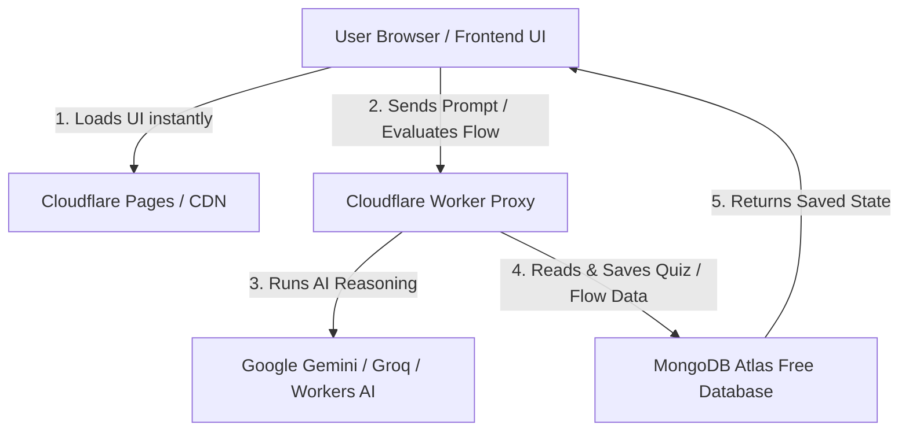

# Tech Stack Guide for Designers: Cloudflare, MongoDB & Free Tools

A practical, designer-friendly guide to understanding **Cloudflare**, **MongoDB**, and modern free infrastructure tools — specifically tailored for the **Interaction & Design System AI Platform**.

---

## 1. Executive Summary: Are They Helpful for This Project?

| Tool | Helpful for this project? | Why it matters | Free Tier Availability |
| :--- | :---: | :--- | :--- |
| **Cloudflare** | **YES (Crucial)** | Hosts your website globally for free, hides your secret AI API keys securely, and delivers your app in <50ms anywhere in the world. | **100% Free** (Cloudflare Pages & Workers) |
| **MongoDB** | **YES (High Value)** | Saves user quiz scores, custom hierarchy flow trees, starred topics, and multi-step inputs as flexible JSON. | **100% Free** (MongoDB Atlas 512MB M0) |

---

## 2. Deep Dive: Cloudflare

### What is Cloudflare in Plain Designer Language?
Think of Cloudflare as the **global postal and security network** of the internet. Instead of hosting your website on a single computer in one city, Cloudflare distributes copies of your design to **330+ cities worldwide**. When a user visits your app from Tokyo, London, or Mumbai, it loads from their local city in milliseconds.

```
Without Cloudflare:
[User in London] ────── 8,000 km lag ──────> [Your server in US] (Slow: ~400ms)

With Cloudflare:
[User in London] ── 5 km ──> [Cloudflare London Edge] (Instant: ~20ms)
```

### Where Cloudflare Helps in THIS Project
1. **Free Global Web Hosting (Cloudflare Pages)**:
   - Connects directly to your GitHub repository `AI_chatbot`.
   - Every time you push code, it automatically deploys a live HTTPS website with a custom link (e.g. `https://design-system-ai.pages.dev`).
2. **Hiding Your Secret AI API Keys (Cloudflare Workers)**:
   - Currently, API keys placed directly in client JavaScript can be seen by anyone opening DevTools.
   - A Cloudflare Worker acts as a lightweight **secure proxy**: your app sends the prompt to the Worker, and the Worker talks to Gemini/Groq using hidden secrets.
3. **Cloudflare Workers AI (Free Built-in LLMs)**:
   - Cloudflare provides free serverless AI models (like Llama 3, DeepSeek, Mistral) that run directly on their edge network without needing third-party API accounts.

### What Should a Designer Learn About Cloudflare?
- **Perceived Latency & TTFB (Time to First Byte)**: How edge delivery makes UI transitions feel immediate.
- **Environment Variables**: How backends securely store secrets vs what is exposed to the browser.
- **Continuous Deployment (CI/CD)**: How pushing to GitHub instantly updates the live design.

---

## 3. Deep Dive: MongoDB

### What is MongoDB in Plain Designer Language?
Think of MongoDB as a **smart digital filing cabinet of JSON cards**. 
Traditional databases (SQL) require rigid tables with strict columns. MongoDB stores data as **documents** (JSON objects), which look identical to how designers and frontend code structure UI state.

```json
// Example of how MongoDB stores a User's Hierarchy Flow:
{
  "userId": "rahul_ux",
  "challengeTitle": "4-Level Filter Architecture",
  "score": 94,
  "nodes": [
    { "level": 1, "title": "Primary Tab (Assets)" },
    { "level": 2, "title": "Filter Drawer (Sector & Market Cap)" },
    { "level": 3, "title": "Folder Directory (Tech Stocks)" },
    { "level": 4, "title": "File View (TCS Performance)" }
  ],
  "createdAt": "2026-08-24T00:15:00Z"
}
```

### Where MongoDB Helps in THIS Project
1. **Saving Custom Hierarchy Flow Trees**:
   - When a user chains custom inputs (`+` button) to build a navigation flow, MongoDB saves their custom tree so they can reload or share it.
2. **Tracking Learning Progress & Quiz History**:
   - Storing user scores across modules (*Modals vs Drawers, Tabs vs Segments, Motion Curves*).
   - Showing a "Streak" or "Mastery Level" in the sidebar.
3. **Community Challenges**:
   - Allowing users to publish design questions and solve each other's hierarchy flows.

### What Should a Designer Learn About MongoDB?
- **JSON Data Modeling**: Understanding that every UI component (a task card, a quiz question, a user profile) maps directly to a JSON document.
- **CRUD Operations**: **C**reate (save a flow), **R**ead (load chat history), **U**pdate (mark task complete), **D**elete (remove node).
- **MongoDB Atlas UI**: Navigating the free cloud web interface to inspect your data visually.

---

## 4. Architecture Blueprint: How They Work Together



---

## 5. Other 100% Free Tools Every Product Designer Should Know

| Category | Tool | What it Does | Free Tier Benefits |
| :--- | :--- | :--- | :--- |
| **Backend & Auth** | **Supabase** | Firebase alternative with instant Auth, Postgres DB, and Realtime sync. | 2 free projects, 50,000 monthly active users, Google/GitHub login. |
| **AI LLM Inference** | **Google AI Studio** | Generates Gemini API keys for prompt engineering. | 1,500 free requests/day, 1M context window. |
| **Fast AI Inference** | **Groq Cloud** | LPU hardware running open models (Llama 3.3, DeepSeek) at 500+ tokens/sec. | Completely free developer tier. |
| **Micro-Animations** | **LottieFiles** | Lightweight vector animation format (JSON) for icons & success states. | Free library of thousands of interactive UI animations. |
| **Modern Icons** | **Google Material Symbols & Lucide** | Variable icon fonts with adjustable weights, fills, and optical sizes. | 100% free open-source. |
| **Color & Accessibility** | **Huetone / Contrast Grid** | APCA & WCAG contrast calculation for dark/light themes. | Free web apps for accessible palette generation. |

---

## 6. Recommended Next Steps for You as a Designer

1. **Step 1: Deploy to Cloudflare Pages (5 mins)**
   - Go to [pages.cloudflare.com](https://pages.cloudflare.com)
   - Connect your GitHub account and select repo `AI_chatbot`.
   - Click **Deploy** — your interactive AI platform is now live on the global web!

2. **Step 2: Setup MongoDB Atlas (Optional when ready for user accounts)**
   - Create a free cluster on [mongodb.com/atlas](https://www.mongodb.com/atlas).
   - Use it to persist user session progress and custom hierarchy flows.
